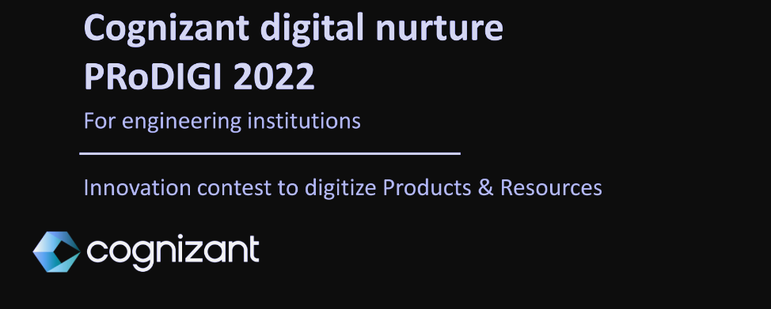

<h1  align="center"  ><b style="font-size:40px">CTS Digital ProDigi</b>
</h1>

<h3 align="center" style="font-size:30px">Connected experiences for consumers</h3>

### **Problem Statement**

#### **Connected experiences for consumers**

How do you ensure that consumers are loyal to brands and will not switch between brands? Brenda is a retail store assistant, working for a large cosmetics retailer. She has been noticing that many of her loyal customers who would buy a certain shade of lipstick or eye shadow have been switching to a rival brand which makes similar shades at a lower price. However, she realizes that her brand has much betterquality products, and would like to provide attractive offers to her customers to retain them. She would like to have solutions for: • Digitizing the buying cycle of the consumer through DTC (Direct-to-Consumer) • Hyper-personalizing consumer experience using insights into individual preferences • Digital marketing campaigns and loyalty programs.

#### **Content**

- <a href="#backgroundWork">Our background work and studies for this</a>
- <a href="#articlesAndResearch">Reference Articles and Research papers</a>
- <a href="#pastWork">Past Work</a>
- <a href="#existingWork">Existing work in the domain</a>
- <a href="#unique">Why is our idea unique?</a>
- <a href="#comparision">Comparision with existing work in this domain</a>
- <a href="#detailedIdea">Detailed Idea</a>
- <a href="#implementation">Implementation</a>
- <a href="#howWillThisWork">How will this work?</a>

<h2 style="font-size:20px" id="backgroundWork"><b>Our background work and studies for this</b></h2>

- So looking at our topic we tend to know of the basic points about how consumers are loyal to brand .You should always provide value to your customers and do so in a way that makes you stand out from competitors. And this doesn’t just apply to the goods or services they may purchase from you. Customers expect a certain level of **quality**. Exceed it. Maintaining a consistent level of quality that offers a no-brainer level of value to the customer will keep them coming back. While your brand may resonate with your persona, if your behind-the scenes-brand is not responsive to your audience, you can quickly lose that **loyalty**. For example, if someone sends you a message on social media or a question by social or email, having a process to follow up with those individuals is critical to maintaining loyalty and **trust**. Customers will feel more **connected** to the brand if they open up a two-way dialogue, and these passionate customers who take the time to give feedback will be your biggest advocates. This also helps you gain insights on how to improve your offerings and give them exactly what they want.

- The **DTC** (direct-to-consumer) market has been growing rapidly, with double-digit rates for several years. It is projected to maintain a further **19.2%** growth in **2021**. It’s no coincidence that when asked about the main challenges facing brands in eCommerce in **2019**, most indicated DTC **growth** as their main threat, even ahead of **Amazon’s influence**, according to a study by DEG Digital in 2019. The superdigitalisation generated by the COVID-19 crisis will affect many of those who don’t accelerate their efforts in Direct-to-Consumer, Online-to-Offline or other channel transformation solutions in the face of new consumer habits.

- This can be seen through the use of **virtual** shopping associates or customizable products... Allowing for these experiences changes retail from being a shopping destination to becoming an online activity for customers to experience the brand. This is only accelerated with the rise of omni-channel brands. Customers are now equipped with the tools to digitize their experience even inside a physical retail location, bringing their online customer experience into the store through the use of technology. This starts with using behavioral analytics to sort products in a way that maximizes conversation. Then once a customer walks in to the store, he or she can use his or her mobile technology to get product recommendations and be directed to various products and departments.

<h2 style="font-size:20px" id="articlesAndResearch"><b>Reference Articles and Research papers</b></h2>

- [The rise of Direct-to-Consumer. Why DTC is a trend that will change… | by Good Rebels | Medium](https://medium.com/@goodrebels/the-rise-of-direct-to-consumer-7fb82066d40d)

- [Connecting with meaning - Hyper-personalizing the customer experience using data, analytics, and AI (deloitte.com)](https://www2.deloitte.com/content/dam/Deloitte/ca/Documents/deloitte-analytics/ca-en-omnia-ai-marketing-pov-fin-jun24-aoda.pdf)

- [15 Ways To Increase Brand Loyalty And Retain Your Customer Base (forbes.com)](https://www.forbes.com/sites/forbesagencycouncil/2018/03/12/15-ways-to-increase-brand-loyalty-and-retain-your-customer-base/?sh=3a354ef07733)

<h2 style="font-size:20px" id="pastWork"><b>Past Work</b></h2>

- We have some great past experiences as we were **SIH National finalist** and have participated in so many other **national** and **global** level **hackathons** like **Code Gladiators** where our team member reached the **Semi-finals**, **Adobe Analytics** Challenge, **MLH INIT Hackathon** (highest rank secured by team is **31**) and many more. We as a team are proficient with skills like **Blockchain**, MERN stack development, **DevOps**, Microservices, ML and database management.
- We are tech enthusiast who keep exploring about the different tech stack, are great learners and most importantly innovative thinkers and dedicated workers. If our idea gets selected for this round, we would try to come with some amazing version of project and would scale it make a complete solution for the given problem statement.

<h2 style="font-size:20px" id="existingWork"><b>Existing work in the domain</b></h2>

- **Augmented reality** is a technology that allows a digital or computer-generated object to exist overlaying the physical world. Using special tools, the user can manipulate this object, change its position, size, or even color, and see how it will look in each possible configuration.
- A lot of fashion industry brands are currently using AR to facilitate online shopping by offering shoppers a chance to see what they’re actually paying for.
- Brands like **Gap**, **Warby Parker**, and **Michael Kors** are among the many offering AR tools.
  - Gap allows the user to insert their measurements into the brand’s online app, and then it creates a virtual **avatar** that they can use to try on different garments.
  - Michael Kors uses this feature on its social media platforms, where buyers can check the company’s Facebook ads and press the try-on button to see how a piece of accessory such as watches or sunglasses will look.
  - Warby Parker also has a unique AR application, where potential buyers can try different shapes and models of their sunglasses and eyeglasses. In the beauty industry, the MAC Cosmetics website lets users try on different shades of **lipstick and eyeshadow with either a smartphone or desktop computer.**
  - Dulux Paint Uses AR to Show Paint Colors on Customers’ Walls. With its Visualizer App, paint company Dulux lets shoppers see how more than 1,200 paint colors would look on their walls. This solves the age-old problem of trying to visualize a tiny square color sample expanded to cover a room.
  - Wannaby & Warby Parker Apps Let Shoppers Try Stuff on at Home. The Wanna Kicks app by Wannaby lets shoppers try on sneakers from home. All users have to do is download the app, hold out their feet, and select from available sneaker styles to see what various shoes would look like on their feet.
- Augmented Reality is the **future of eCommerce businesses**. AR has many things to offer in the eCommerce business, from improved customer engagement to improved conversion rates. The eCommerce market is not fully saturated by AR technology yet. This is the **best time to adapt** to the new emerging technology to give a competitive edge. Adapting Augmented Reality in eCommerce can lead to a win-win situation for online business owners and customers.

<h2 style="font-size:20px" id="unique"><b>Why is our idea unique?</b></h2>

- We are well aware that some brands like Gap and Michael Kors are the ones who are already offering this kind of solution. These brands have some features for some specific products. Mainly these brands are offering this feature on the wearables while we focus to provide this to all the products available on our website. We will try to ensure that even if there exist a product which cannot be applied to your space then we can **provide a 3D visual** of the same on the website itself.
- Making the products available online will provide user with a ready to buy experience where customer can easily **compare** the products and make it available at their door steps. Looking upon the business value aspect, this step can help scale the sale for customers who find it difficult to visit the store and purchase cosmetics specially when their order is not much. On the other hand, when purchasing online, customers can even opt to order a single lipstick or any other product.

<h2 style="font-size:20px" id="detailedIdea"><b>The detailed project description and Uniqueness of project.</b></h2>

- The online retail store can be implemented with a bunch of features which make the brand more attractive and appealing for its users. Some of the features that can be included in initial phase is a complete overview of products, comparison of product stats with other brands, benefits on every purchase and loyalty program. Also, a salient feature can be provided where user can try any facial cosmetic on their face virtually using the Augmented Reality.

- The website will also have an amazing search engine optimization(**SEO**) which will promote the most frequently brought products or the products according to user preference. This website can be a one stop solution to all the costumer's cosmetic needs.

<h2 style="font-size:15px" id="implementation"><b>Implementation</b></h2>

- As a most business **update** and **integrate** their new ideas, our implementation is the same. Adding new features and updating the application will be easy because we will be using **DevOps**.
- Using **Docker**, and **Kubernetes** and structuring our application based on **Microservices architecture** each component of our website will be divided into a service. All the services will be self-contained therefore if one of them went down other will run just fine. This customer who is really important to Brenda will be retained. Additional services like **even-bus** will be created to create a different/copy of the database for every service, a response queue for **cashing** requests from **stopped services**, and many more.
- We can use modern **JS Frameworks**(React/Next) to build the front end of our web application and the backend + DevOps can be implemented using **NodeJS**, Docker, and Kubernetes. Using these technologies, we will be able to implement our business model so that it can sustain the market demands. Continuous Integration and Development(**CI/CD**) will be easier using web service providers. Using providers like **AWS** and **Asure** we can **deploy** our **Kubernetes Cluster** and integrate the new feature.
- Our idea is completely scalable as we will be using Microservices using Node JS, when the Large Cosmetics Retailer shop will be connected to the user via a web app it will face high traffic for that a proper Architecture will be followed so that each service will be independent and even if one goes down the other will be running properly without issue concepts like Event Bus and **Data Synchronization** will be put into use. Using Web Services will **automatically** increase the **servers** on **high-demand** days using an elastic load balancer(**ELB**) therefore we need to pay only for the resources we are using.

<h2 style="font-size:20px" id="howWillThisWork"><b>How will this work?</b></h2>

- Our team has past experience to develop Web Applications, so this will be a challenging task for us but there is nothing we can't do. We will first create a base app that will serve as a prototype and act as a base then we will release new versions of this application with features that we have promised. This will follow a proper software architecture plan.

